> [返回首页](../README.md)｜[画廊总览](gallery.md)｜[下一册：案例 25–48](gallery-part-2.md)

# 🖼️ 提示词画廊 · 第一册

## 📊 信息图与知识视觉

<a id="case-01"></a>
### 案例 01：城市十五分钟生活圈图谱

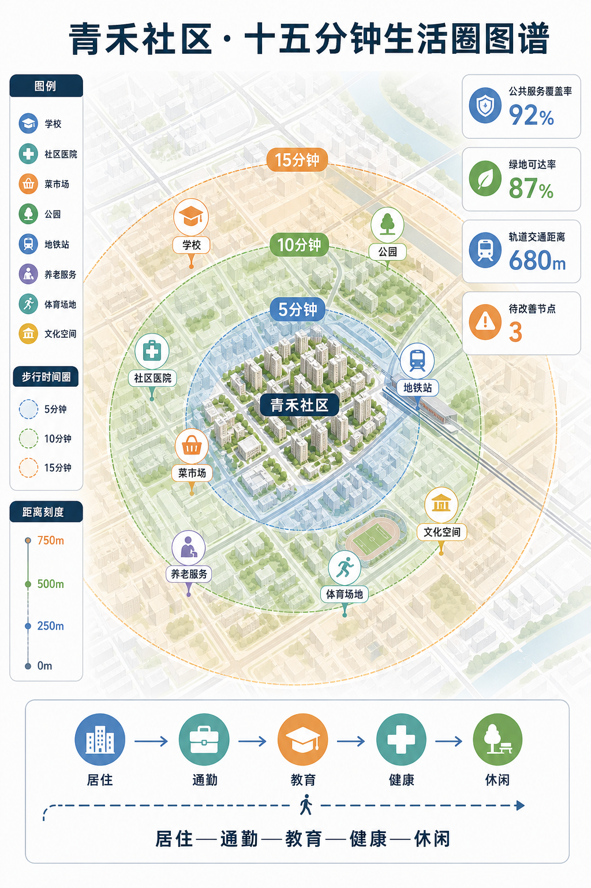

**标签：** `信息密度` `地图` `中文排版`　**画幅：** `4:5`

```text
生成一张“十五分钟生活圈”城市规划信息图，主题区域为[城市/街区]。画面以轻微轴测鸟瞰地图为核心，中心标出住宅社区，向外绘制5、10、15分钟三层半透明步行圈；用不同颜色和简洁图标标注学校、社区医院、菜市场、公园、地铁站、养老服务、体育场地、文化空间。左侧放“步行可达性”图例与距离刻度，右侧放四项摘要：公共服务覆盖率[数值]、绿地可达率[数值]、轨道交通距离[数值]、待改善节点[数值]。顶部标题必须准确显示“[街区名]·十五分钟生活圈图谱”，底部用一条横向动线解释“居住—通勤—教育—健康—休闲”。风格为现代城市研究报告、浅灰白底、低饱和蓝绿橙配色、细线、清晰层级、适量留白。地图是主角，不要做成房产广告，不要复杂3D城市，不要虚构难以阅读的小字。高分辨率，4:5竖版。
```

---

<a id="case-02"></a>
### 案例 02：咖啡从种子到杯子的流程图

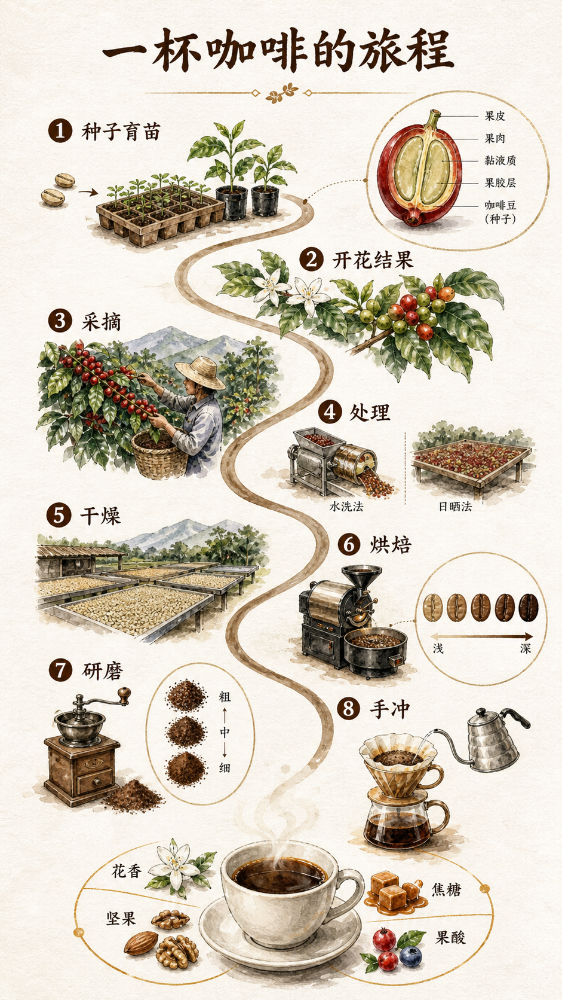

**标签：** `流程` `科普` `手绘`　**画幅：** `9:16`

```text
设计一张竖版科普信息图《一杯咖啡的旅程》。从上到下用一条连续S形路径串联8个步骤：种子育苗、开花结果、采摘、处理法、日晒或水洗、烘焙、研磨、手冲。每一步包含一个精致的水彩剖面小插图、醒目的步骤编号、4至8字中文标题和一句不超过18字的说明。中央穿插三处局部放大：咖啡果剖面、烘焙色阶、研磨粗细。底部呈现一只完成的手冲咖啡杯，并用风味轮标出花香、坚果、焦糖、果酸。背景为暖白棉纸，主色咖啡棕、浆果红、叶绿与少量金色，线条像自然科学笔记。标题必须准确，信息丰富但每个模块留白清楚。不要品牌Logo，不要把咖啡豆画成可可豆，不要生成无意义段落。9:16，高清印刷质感。
```

---

<a id="case-03"></a>
### 案例 03：中国节气与农事年轮

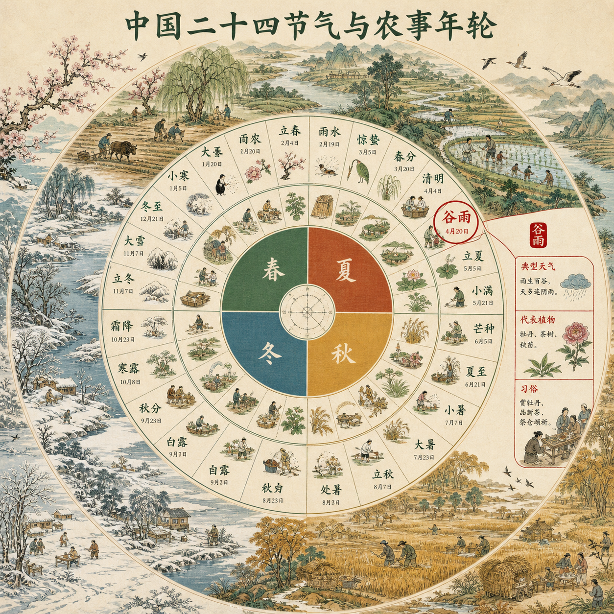

**标签：** `圆形构图` `国风` `知识图谱`　**画幅：** `1:1`

```text
制作一张方形“中国二十四节气与农事年轮”图谱。以同心圆构图表现一年循环：最内圈为春夏秋冬四色渐变，第二圈按顺时针完整排列24节气名称，第三圈绘制对应物候与农事小图标，外圈用山水、田野、河流、候鸟形成四季连续长卷。重点突出[指定节气]，用朱红印章与细线标注其日期范围、典型天气、代表植物和传统习俗。整体融合宋代博物画、现代数据可视化和宣纸套色印刷，墨线细腻，青绿、赭石、藤黄、朱砂配色克制。所有24个节气必须顺序正确、文字清楚；不要堆叠诗句，不要现代卡通icon，不要金龙祥云等泛国潮符号。1:1，适合海报印刷。
```

---

<a id="case-04"></a>
### 案例 04：个人年度数据故事

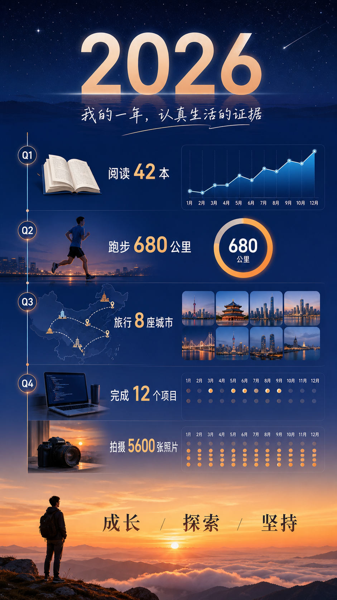

**标签：** `数据叙事` `年度报告` `社交分享`　**画幅：** `9:16`

```text
根据以下数据生成一张个人年度回顾长图：[输入6至10项数据，例如阅读42本、跑步680公里、旅行8座城市、完成12个项目、认识36位新朋友]。顶部以大数字“[年份]”和标题“我的一年，认真生活的证据”建立主视觉；中部按时间线分成四个季度，每季用一个核心事件插画和2项数据；穿插折线、环形进度、里程地图与微型日历，但每种图表只出现一次。底部总结三个年度关键词“[关键词1] / [关键词2] / [关键词3]”和一句写死的结语“[结语]”。视觉为精致编辑设计，深蓝夜空到晨曦橙的纵向色彩变化，数字大、说明短、图标统一。不得自动编造数据，不要企业年报感，不要拥挤卡片墙，所有关键数字必须准确。9:16，手机阅读安全区内排版。
```

## 📰 海报与字体设计

<a id="case-05"></a>
### 案例 05：未来阅读节概念字体海报

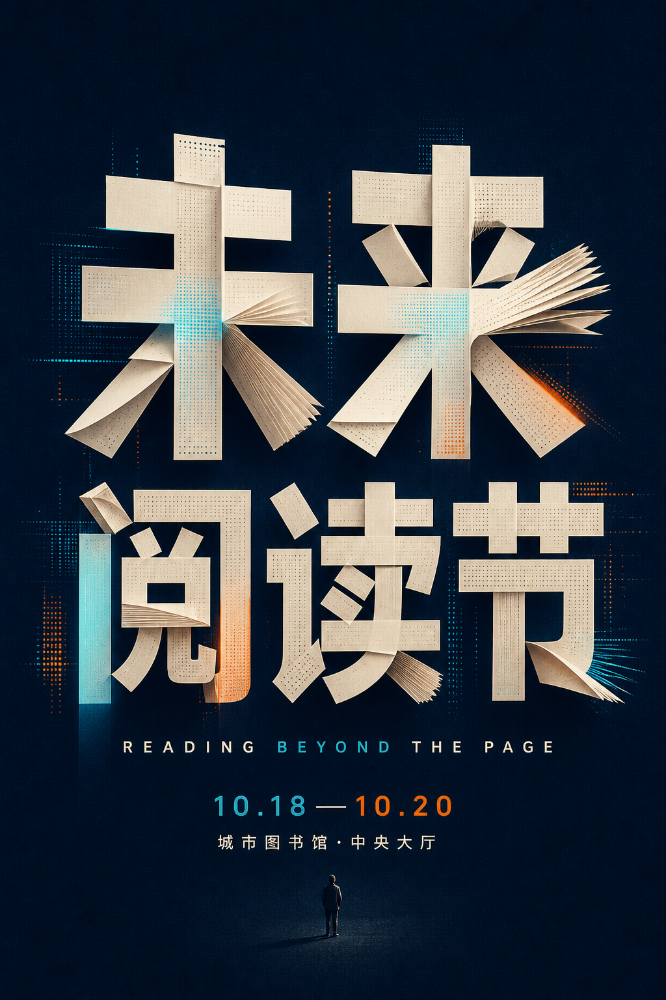

**标签：** `概念字体` `文字排版` `活动海报`　**画幅：** `2:3`

```text
为活动“未来阅读节”设计一张单幅概念字体海报。主标题“未来阅读节”必须四字完整、巨大、清晰，字形由翻动书页的折面与数字光栅共同构成，局部文字像书页向外展开，但不能损害可读性。副标题写死为“READING BEYOND THE PAGE”，日期“10.18—10.20”，地点“城市图书馆·中央大厅”。构图采用中央纵向巨型标题，人物只作为底部很小的尺度参照；背景为深墨蓝，主字为暖白纸张质感，点缀电光青和荧光橙。风格结合瑞士国际主义排版、纸艺装置摄影和未来出版实验，锐利裁切、强负空间、轻微网点印刷颗粒。只生成一张成品海报，不要moodboard，不要样机，不要多方案拼版，不要额外编造文字。2:3竖版。
```

---

<a id="case-06"></a>
### 案例 06：非遗主题双重曝光海报

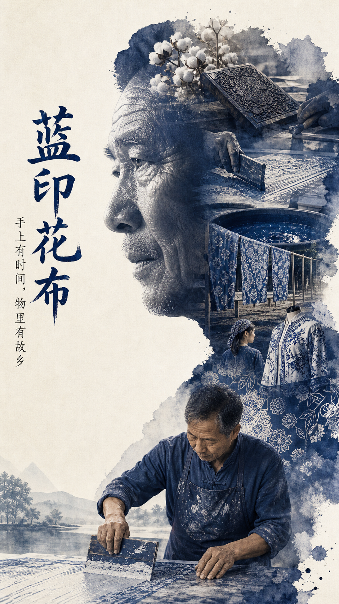

**标签：** `非遗` `双重曝光` `叙事海报`　**画幅：** `9:16`

```text
以[非遗项目，例如蓝印花布/木版年画/皮影戏]为主题，生成收藏级双重曝光海报。上半部是一位非遗传承人的巨大侧脸剪影，面部保留真实皱纹、专注眼神和手工劳动痕迹；剪影内部融合原料采集、工具、关键工序、代表纹样、作坊空间与成品使用场景，按照“材料—手艺—传承”形成从上到下的叙事动线。中下部放传承人正在制作的半身场景，双手动作准确。背景大面积米白留白，主色从[工艺主色]提取，辅以墨黑和旧金；边缘用纤维、颜料渗化或木刻刀痕自然过渡。标题仅写“[非遗项目名]”，副题“手上有时间，物里有故乡”。不要硬拼贴，不要旅游纪念品感，不要无关古建筑，不要夸张仙侠特效。9:16，高级纪录片海报质感。
```

---

<a id="case-07"></a>
### 案例 07：独立电影极简海报

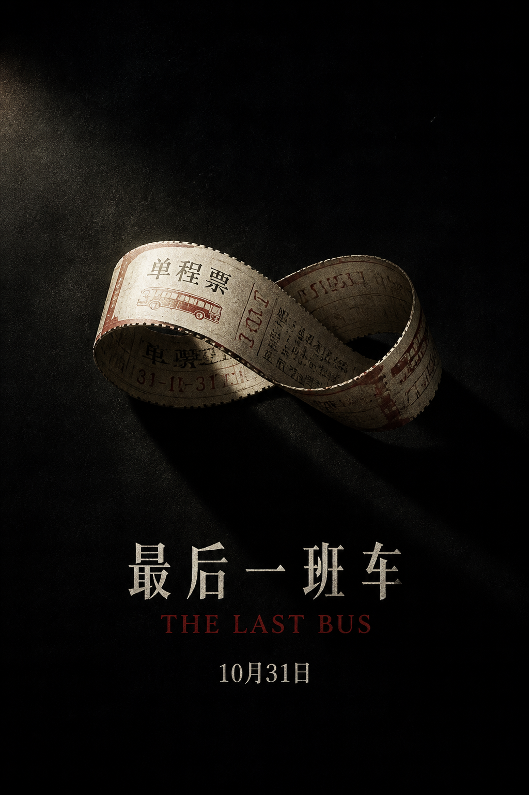

**标签：** `电影` `极简` `视觉隐喻`　**画幅：** `2:3`

```text
为独立电影《[片名]》设计极简电影海报。故事核心：[一句话梗概]。只选择一个能概括冲突的视觉隐喻：[物体A]与[物体B]以不可能但可信的方式结合，位于画面中央，占面积25%至35%；周围保留大面积[背景色]负空间。采用真实静物摄影与轻微超现实处理，单一硬光从左上方投下长阴影，材质细节清晰。片名位于上方，演员名与上映日期置于底部细小排版，文字内容严格使用提供的信息。调色限制在黑、米白、暗红三色，带轻微胶片颗粒与套印偏差。不要人物大头照，不要场景拼贴，不要奖项月桂和虚构影评，不要多个概念并列。2:3竖版，院线印刷完成度。
```

---

<a id="case-08"></a>
### 案例 08：城市夜跑活动海报

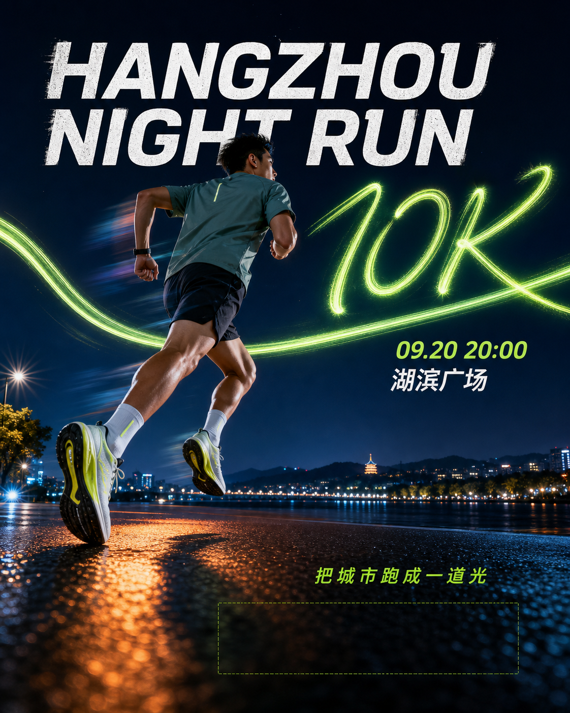

**标签：** `运动` `动态排版` `活动视觉`　**画幅：** `4:5`

```text
设计一张“[城市名] NIGHT RUN”夜跑活动海报。低机位广角捕捉一名跑者冲过潮湿街道，鞋底离地，身体略向前，动势从左下指向右上；城市地标只以远景光影轮廓出现。用一条荧光绿GPS轨迹贯穿画面，轨迹同时形成数字“10K”。标题“[城市名] NIGHT RUN”放在右上，日期“[日期] 20:00”，集合点“[地点]”，标语“把城市跑成一道光”。视觉为运动品牌Campaign、真实夜景摄影、冷蓝环境光、路面橙色反射、轻微速度拖影和颗粒。跑者肢体与鞋子结构准确，标题不能遮脸。不要多人杂乱拼贴，不要虚构赞助Logo，不要赛博朋克霓虹过量。4:5，预留底部报名二维码安全区但不要生成二维码。
```

## 🛍️ 电商与产品视觉

<a id="case-09"></a>
### 案例 09：香水高端棚拍主图

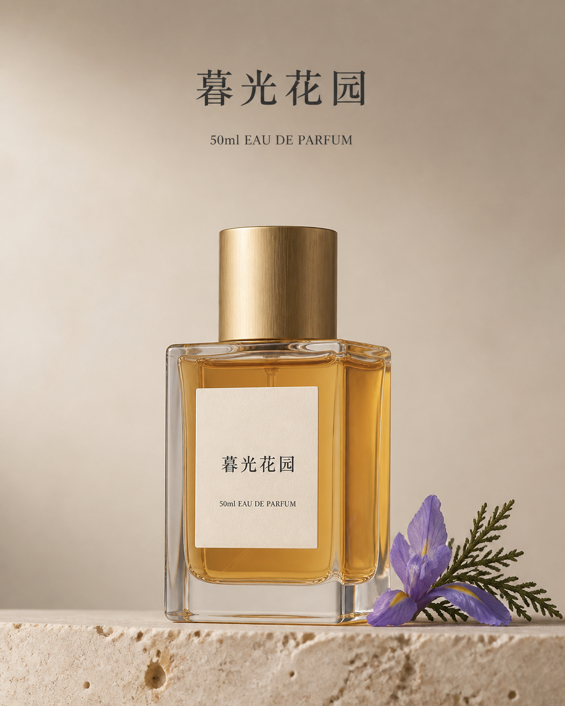

**标签：** `商品摄影` `材质` `商业可用`　**画幅：** `4:5`

```text
为[香水名称]生成高端电商主图。严格保持参考图中瓶身比例、瓶盖结构、标签文字位置和液体颜色；产品以3/4正面角度立在浅色洞石台面中央，占画面55%。背景为从象牙白到[品牌强调色]的极浅渐变，左后方柔光箱形成顺滑高光，右侧细窄轮廓光勾勒玻璃边缘，台面有清晰但克制的折射和软阴影。旁边只放[原料1]与[原料2]各一小枝，用于暗示香调。上方留出文案区，下方只显示准确文字“[香水名称]”与“[容量] EAU DE PARFUM”。真实玻璃、金属和液体材质，广告级精修。不要改变瓶型，不要额外Logo，不要漂浮花瓣雨，不要过曝，不要出现手。4:5，适合电商首图。
```

---

<a id="case-10"></a>
### 案例 10：户外冲锋衣详情页首屏

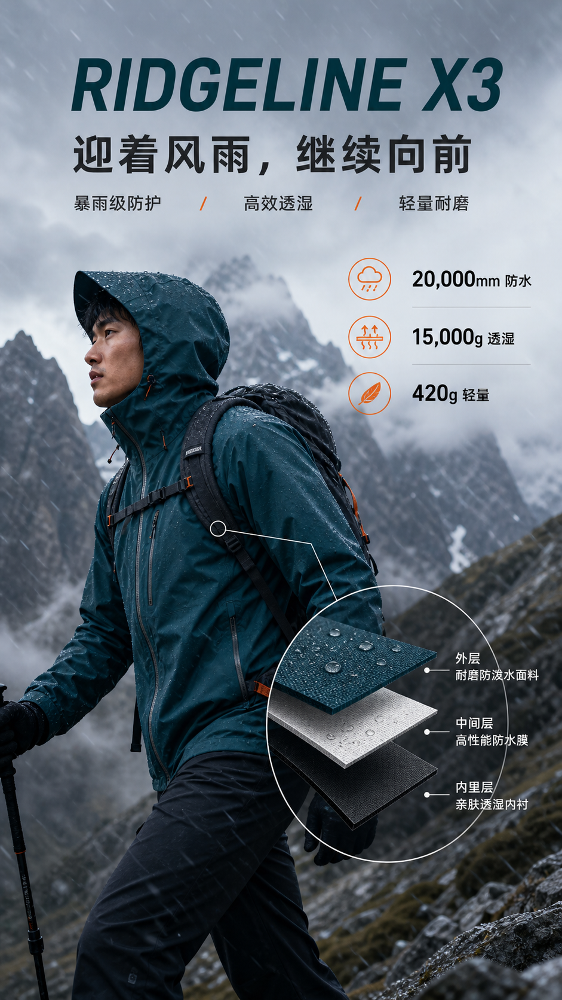

**标签：** `服装` `详情页` `卖点可视化`　**画幅：** `9:16`

```text
生成[品牌/型号]冲锋衣电商详情页首屏。主体是一位亚洲户外爱好者在高山风雨环境中侧身行进，冲锋衣款式、颜色、口袋、拉链和Logo位置严格依据参考商品图；人物占画面45%，右侧展示衣服局部剖面放大：三层面料、防水膜、内衬，用细线连接主体。顶部标题“迎着风雨，继续向前”，副标题“[防水指数]｜[透湿指数]｜[重量]”；底部横排三个卖点“暴雨级防护 / 高效透湿 / 轻量耐磨”。环境真实但不遮挡服装，冷灰山雾配品牌强调色，摄影与技术说明图自然融合。不要虚构认证，不要改变服装版型，不要满屏水花，不要让文字压住产品。9:16，高端户外品牌视觉。
```

---

<a id="case-11"></a>
### 案例 11：降噪耳机爆炸结构图

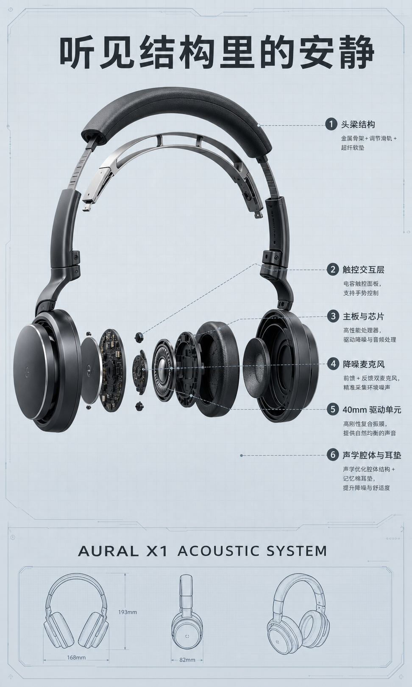

**标签：** `工业设计` `爆炸图` `标注`　**画幅：** `4:5`

```text
制作一张[耳机型号]头戴式降噪耳机的爆炸结构图海报。产品在画面中心以3/4角度悬浮，左右耳罩沿轴线分解为外壳、触控层、主板、降噪麦克风、40mm驱动单元、声学腔体、记忆棉耳垫；头梁分解为金属骨架、调节滑轨和软垫。所有零件间距均匀、轴向关系正确，细线连接6个编号注释。标题“听见结构里的安静”，副标题“[型号] Acoustic System”。背景为浅灰蓝工程纸，产品为哑光深石墨色，关键声学路径用一条低亮度蓝色光线表示。高精度工业渲染、柔和棚拍光、细节清楚。不要错误电路，不要重复零件，不要科幻发光过量，不要密集小字。4:5，产品发布会海报质感。
```

---

<a id="case-12"></a>
### 案例 12：地域糕点礼盒视觉

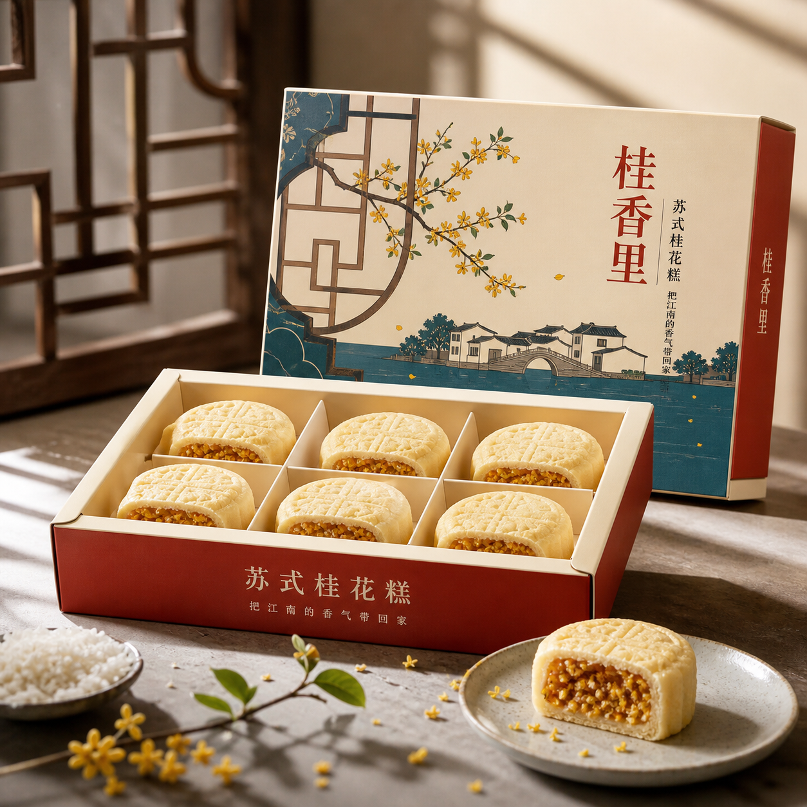

**标签：** `食品` `包装` `地域文化`　**画幅：** `1:1`

```text
为[地域糕点名称]设计一张礼盒主视觉。画面中心是打开的礼盒，内部6枚糕点排列整齐，准确呈现酥皮、馅料切面与碎屑；盒盖立在后方，包装图案从[当地建筑/植物/纹样]提炼为现代平面插画，而非直接贴照片。前景一枚糕点切开，旁边放少量原料[原料1、原料2]。标题只写“[品牌名]”，产品名“[糕点名称]”，短句“把[地域名]的香气带回家”。整体为暖米白背景、朱红与黛青点缀，窗格光影，食品摄影真实诱人，包装设计清楚可见。不要过度古风，不要金龙祥云，不要虚构老字号印章，不要让装饰遮住食物。1:1，适合电商与社媒。
```

## 🧩 品牌与视觉系统

<a id="case-13"></a>
### 案例 13：社区咖啡馆品牌情绪板

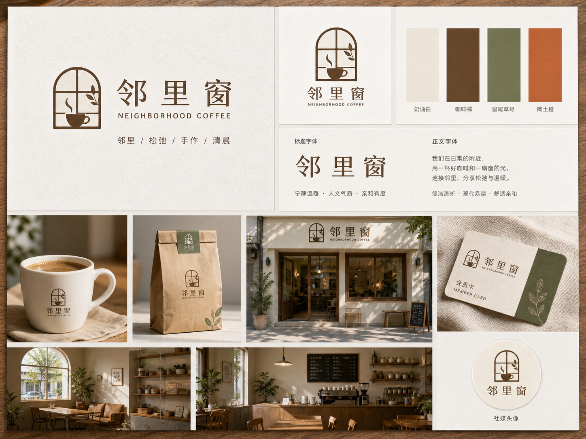

**标签：** `品牌` `情绪板` `触点`　**画幅：** `4:3`

```text
为社区咖啡馆“[品牌名]”制作一张完整但克制的品牌情绪板。品牌关键词：邻里、松弛、手作、清晨。画面按清晰网格展示：主Logo与图形标、奶油白/咖啡棕/鼠尾草绿/陶土橙四色色板及HEX、标题与正文字体气质、咖啡杯与纸袋、门头、会员卡、社媒头像、两张空间氛围照片。核心图形从“窗户+咖啡蒸汽”提炼，所有触点统一使用。桌面俯拍式品牌板，真实纸张、压印、陶瓷和棉布材质，柔和晨光。每一块有呼吸感，Logo清晰。不要生成十多个Logo方案，不要大段说明，不要仿制知名咖啡品牌，不要随机英文。4:3横版，设计提案完成度。
```

---

<a id="case-14"></a>
### 案例 14：AI 软件 Logo 方向探索

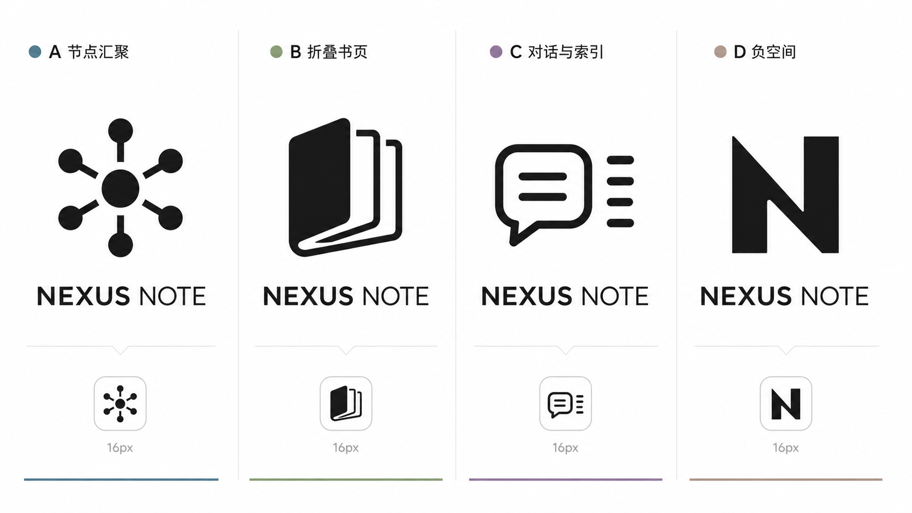

**标签：** `Logo` `方案探索` `几何`　**画幅：** `16:9`

```text
为AI知识管理软件“[产品名]”生成一张Logo方向探索板。品牌含义：[一句话价值]；关键词：清晰、连接、可信、聪明但不炫技。只展示4个差异明显的方向，每个方向包含黑白图形标、横版字标、16px应用图标和一句不超过10字的概念说明：A“节点汇聚”，B“折叠书页”，C“对话与索引”，D“首字母负空间”。使用严格4列网格，白色背景，黑灰为主，每个方向只用一种低饱和强调色。图形必须简单、可缩放、轮廓独立，不依赖渐变和复杂细节。不要样机，不要3D金属Logo，不要抄袭现有AI品牌，不要脑形、电路板和魔法星星陈词滥调。16:9，专业设计评审板。
```

---

<a id="case-15"></a>
### 案例 15：中式茶饮品牌系统板

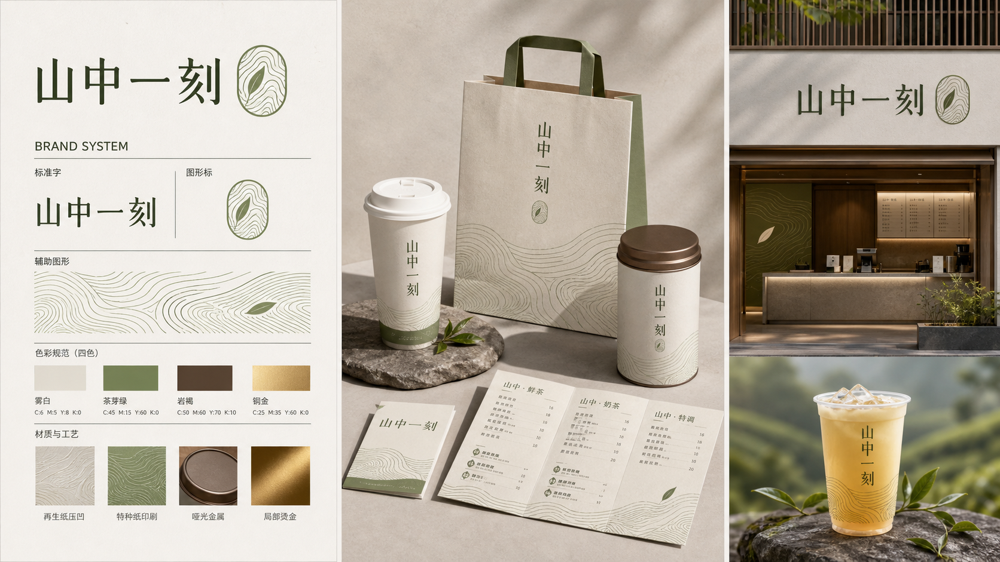

**标签：** `新中式` `VI` `包装`　**画幅：** `16:9`

```text
为新中式茶饮“[品牌名]”设计品牌系统展示板。品牌概念来自[地域茶种]与“山中一刻”的慢节奏。主标志使用现代宋体字标，辅助图形从茶园等高线和一片茶叶的负空间提炼；配色为雾白、茶芽绿、岩褐、少量铜金。画面展示标准字、图形标、四色规范、杯身、外带纸袋、茶罐、菜单和门店局部门头，所有触点共享同一等高线纹样。摄影材质真实：再生纸、哑光金属、半透明茶汤、细腻压凹。排版像高端品牌手册，横向三段式，标题“[品牌名] BRAND SYSTEM”。不要水墨山水堆砌，不要印章泛滥，不要仿古牌匾，不要虚构英文故事。16:9。
```

---

<a id="case-16"></a>
### 案例 16：环保清洁品牌包装家族

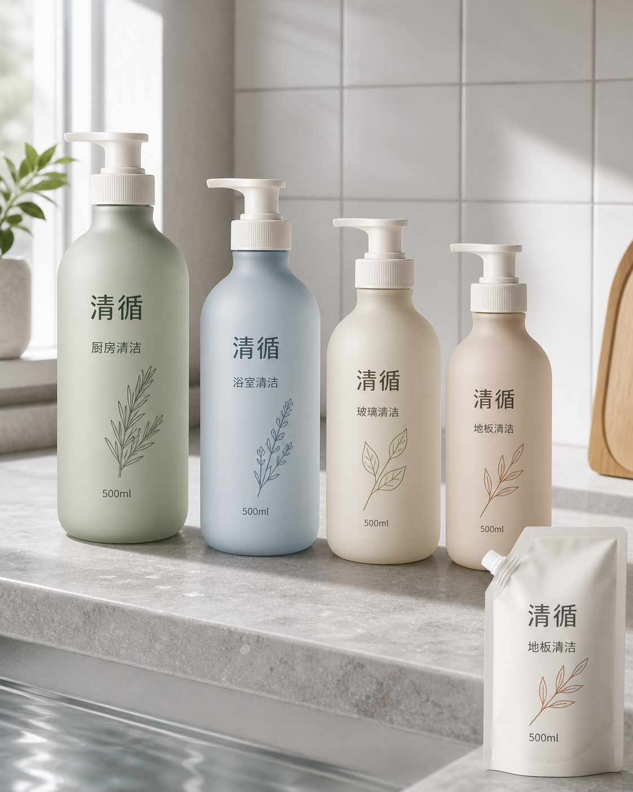

**标签：** `包装家族` `可持续` `系列一致性`　**画幅：** `4:5`

```text
设计环保家居清洁品牌“[品牌名]”的四款包装家族：厨房清洁、浴室清洁、玻璃清洁、地板清洁。瓶型统一为可补充式磨砂再生塑料，泵头结构一致；用四种低饱和颜色区分类别，并以单线植物图形表示主要成分。正面标签信息层级固定：品牌名、产品名、用途、容量[容量]，中文必须清晰。四瓶由高到低排列在浅灰石材台面，背景有水面反光与自然窗光；右下角展示一只补充袋，强调循环使用。风格为北欧功能主义包装与真实商业摄影。不要满版绿色叶片，不要“100%环保”等未经提供的承诺，不要改变每瓶Logo位置，不要玻璃材质。4:5。
```

## 🖥️ UI、网页与应用界面

<a id="case-17"></a>
### 案例 17：专注计时 App 主界面

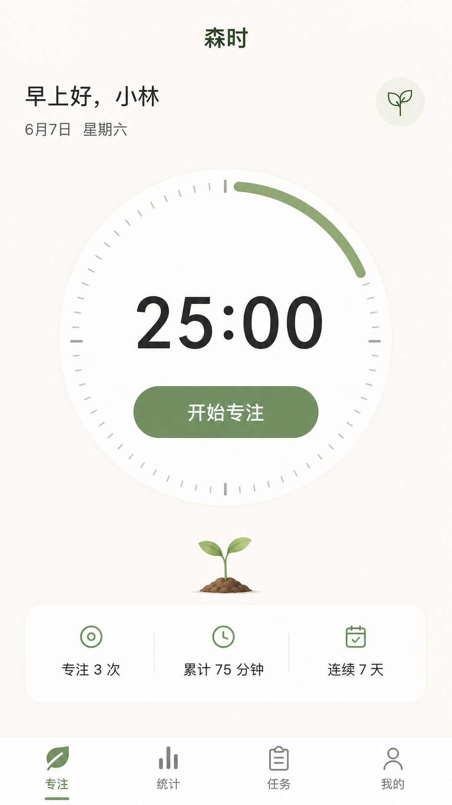

**标签：** `移动端UI` `产品设计` `可读文字`　**画幅：** `9:16`

```text
设计一张真实可用的iOS专注计时App主界面，产品名“[App名]”。顶部显示问候语“早上好，[用户名]”和今日日期；中央是占屏宽65%的圆形计时器，准确显示“25:00”，环形进度只完成约20%，主按钮文字“开始专注”。下方展示今日数据：专注3次、累计75分钟、连续7天；底部导航为“专注 / 统计 / 任务 / 我的”，当前页高亮。视觉采用暖白背景、深石墨文字、鼠尾草绿主色、少量杏橙提醒，圆角克制，阴影极轻，8pt栅格。加入一株很小的成长植物作为进度隐喻，但不能压过计时器。不要手机外框，不要悬浮玻璃拟态，不要密集渐变，不要无意义英文。9:16整页界面截图。
```

---

<a id="case-18"></a>
### 案例 18：AI 学习助手仪表盘

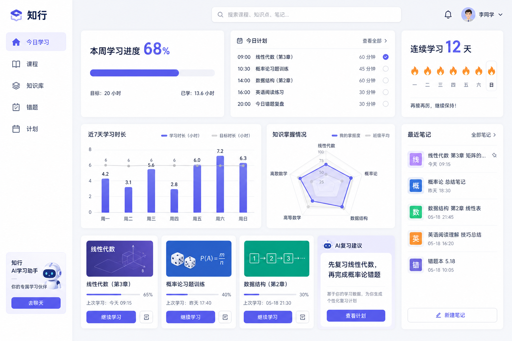

**标签：** `Dashboard` `数据可视化` `Web UI`　**画幅：** `16:10`

```text
设计桌面端“[产品名] AI学习助手”仪表盘，1440px宽。左侧固定导航：今日学习、课程、知识库、错题、计划；顶部是全局搜索和用户头像。主内容使用12列栅格：第一行显示“本周学习进度 68%”与今日计划；第二行左侧为7天学习时长柱线组合图，右侧为知识掌握雷达图；第三行是3张待完成课程卡与一张“AI复习建议”卡，建议只写“先复习线性代数，再完成概率论错题”。右侧窄栏展示连续学习12天和最近笔记。浅灰背景、白卡片、深蓝文字、紫蓝强调色，信息密度高但间距统一。所有数据彼此一致，不要超大空卡片，不要过度玻璃拟态，不要代码界面，不要生成聊天窗口占满页面。16:10，高保真产品截图。
```

---

<a id="case-19"></a>
### 案例 19：旅行产品落地页

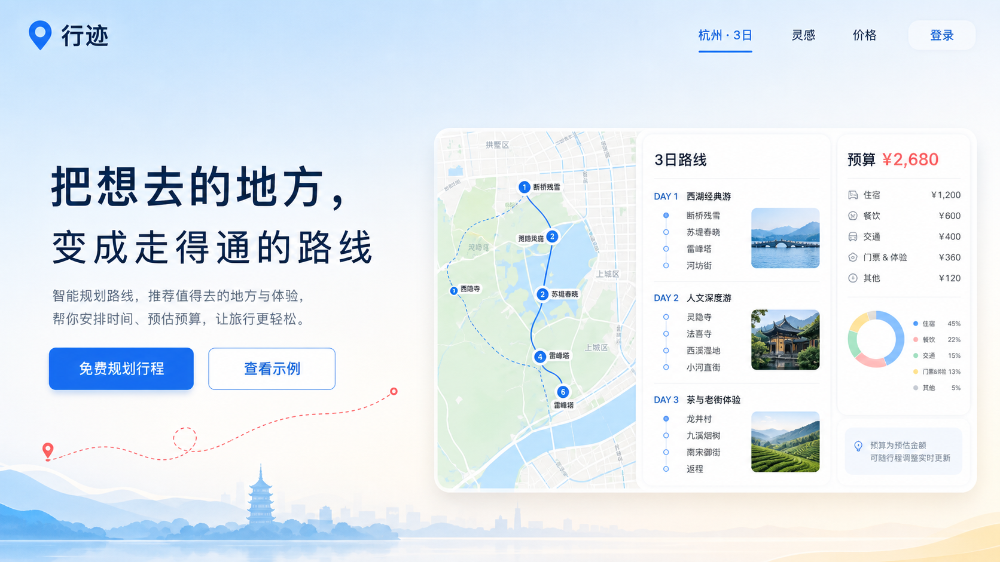

**标签：** `Landing Page` `旅行` `营销`　**画幅：** `16:9`

```text
设计旅行规划产品“[产品名]”桌面端落地页首屏。左侧标题准确写“把想去的地方，变成走得通的路线”，正文两行说明AI根据天数、预算和偏好生成行程；主按钮“免费规划行程”，次按钮“查看示例”。右侧是产品核心交互样机：一张[目的地]地图、3日路线、地点卡片和预算摘要，界面内容清晰可读。背景使用很浅的天空蓝到暖白渐变，叠加一条像旅行轨迹的细红线；顶部导航包含产品名、目的地、灵感、价格、登录。整体像成熟SaaS品牌，真实风景只以两张小卡片出现。不要满屏旅游照片，不要虚构媒体背书，不要飞机绕地球图标，不要按钮过多。16:9。
```

---

<a id="case-20"></a>
### 案例 20：新能源汽车中控界面

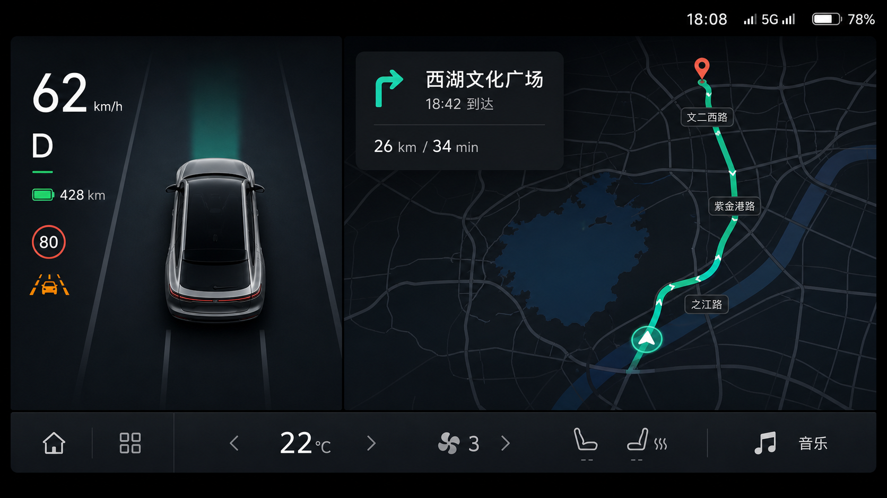

**标签：** `车机HMI` `地图` `暗色UI`　**画幅：** `16:9`

```text
设计一张新能源汽车横向中控屏界面，分辨率1920×1080。左侧35%显示车辆3D俯视图、车速“62 km/h”、挡位D、续航“428 km”；右侧65%为深色导航地图，路线从当前位置到“[目的地]”，预计到达“18:42”，剩余“26 km / 34 min”。底部保留固定空调栏：22°C、风量3、座椅加热关闭、音乐入口；右上角显示时间、5G和电量图标。视觉强调驾驶中一眼可读，黑灰背景、道路低对比、导航路线高亮青绿、警告使用少量橙色，字体尺寸有明显层级。不要影视科幻HUD，不要透明信息漂浮，不要小字过密，不要把地图与车辆信息互相覆盖。16:9，真实量产车HMI。
```

## 📷 人像与商业摄影

<a id="case-21"></a>
### 案例 21：自然职业头像


**标签：** `职业照` `身份保真` `自然光`　**画幅：** `1:1`

```text
基于上传的人物参考图生成自然、可信的职业头像。严格保持脸型、五官比例、发际线、肤色、年龄感与可识别特征，不进行换脸式美化。人物穿[服装，例如深灰针织衫与浅色衬衫]，胸部以上构图，身体微侧、眼睛看镜头，表情放松而自信。背景为浅暖灰办公室虚化，只保留极弱的书架和窗光线索。使用85mm人像镜头观感，眼睛清晰，柔和侧窗光加轻微反光板，保留真实皮肤纹理和少量细纹。色彩自然，不磨皮成塑料，不放大眼睛，不改变鼻口，不使用纯白证件照光，不增加首饰。1:1，头像在圆形裁切后仍完整。
```

---

<a id="case-22"></a>
### 案例 22：杂志感黑白编辑肖像

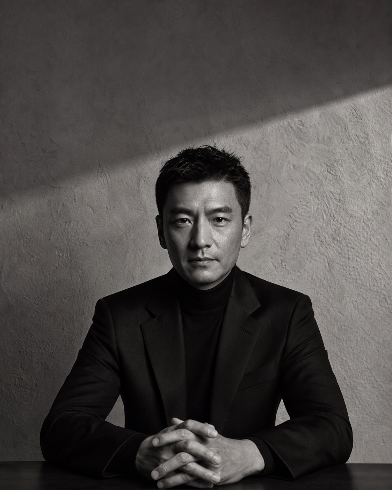

**标签：** `黑白摄影` `编辑肖像` `高对比`　**画幅：** `4:5`

```text
拍摄一张黑白杂志编辑肖像：人物[身份/气质描述]站在粗糙灰泥墙前，半身构图，正面凝视镜头，双手自然进入画面形成稳定三角形。单一大号硬柔结合侧光从右上照射，一侧脸明亮，另一侧保留可见暗部层次，墙面出现长而干净的阴影。服装为结构明确的黑色西装或高领针织，材质纹理清楚。画面模拟中画幅胶片，深黑、银灰、高光不过曝，细颗粒与极轻边缘柔化。顶部留杂志标题空间但不生成任何文字。不要夸张姿势，不要烟雾，不要复古道具，不要皮肤蜡像感。4:5，高级人物专题开篇图。
```

---

<a id="case-23"></a>
### 案例 23：东方新中式时尚大片

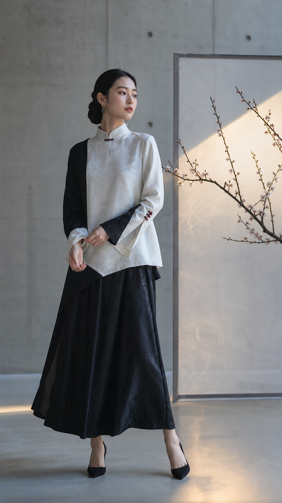

**标签：** `时尚摄影` `新中式` `材质`　**画幅：** `9:16`

```text
生成一张东方新中式时尚大片。模特穿[服装描述]，服装结合简洁立领、非对称裁片与[传统面料/纹样]，禁止戏服化；人物站在现代清水混凝土空间，背后只有一面半透明绢屏和一枝真实梅枝。全身构图，模特重心稳定，一手轻触袖口，视线略过镜头。冷灰天光与一束暖色斜光交叉，突出丝、棉、金属扣的材质差异；色彩限制为墨黑、月白、暗朱红。镜头像高端时装杂志，构图克制、留白充足、轻微动态衣摆。不要大红灯笼、宫殿、龙凤、仙气烟雾，不要过度瘦身，不要错误手指。9:16。
```

---

<a id="case-24"></a>
### 案例 24：街头雨夜电影人像

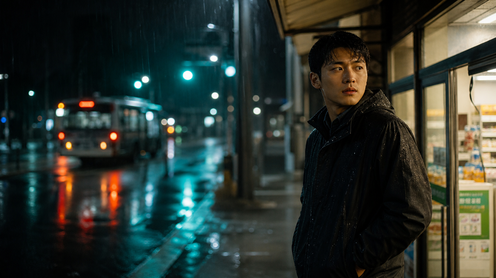

**标签：** `电影感` `夜景` `环境人像`　**画幅：** `16:9`

```text
生成一张雨夜城市街头电影剧照。主角是[人物描述]，穿深色防水外套，站在便利店门外雨棚边缘，侧身回头看向街道；人物位于画面右侧三分之一，左侧留出湿润街道与远处公交车灯。50mm镜头、浅景深但环境可辨，雨滴被店内暖光照亮，路面反射青色交通灯与少量橙红车尾灯。人物脸部由便利店柔光和街道冷光共同塑形，肤色自然，衣料湿润质感真实。氛围安静、悬而未决，不要动作大片，不要赛博朋克招牌海洋，不要浓雾，不要荧光饱和过度，不要让雨水遮住五官。16:9，电影宽幅构图。
```
