> [返回首页](../README.md)｜[画廊总览](gallery.md)｜[上一册：案例 01–24](gallery-part-1.md)

# 🖼️ 提示词画廊 · 第二册

## 🎨 插画与艺术风格

<a id="case-25"></a>
### 案例 25：山城清晨水彩长卷

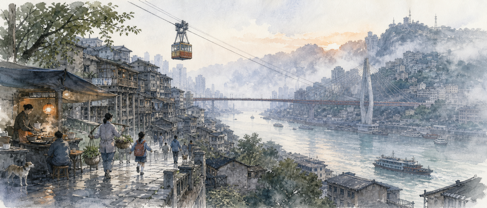

**标签：** `水彩` `城市景观` `叙事`　**画幅：** `21:9`

```text
绘制一幅[山城名称]清晨水彩长卷。视线从左侧河岸早餐摊开始，沿阶梯、吊脚楼、缆车、跨江大桥一路向右上方延伸，最终到达薄雾中的山顶天际线。画面中有10至15个很小但生动的生活片段：开店、送菜、上学、遛狗、晨练、渡船，不出现拥挤人群。建筑顺应坡度层层叠加，空间关系可信；晨雾用湿画法柔化远景，近景用钢笔细线和干笔表现砖墙、电线与植物。配色以雾蓝、灰绿、赭石和早餐摊一点暖橙为主，保留大量纸白。不要旅游宣传画，不要夸张地标拼贴，不要高饱和，不要把山城画成欧洲小镇。21:9超宽幅，可连续阅读的生活长卷。
```

---

<a id="case-26"></a>
### 案例 26：深海生物复古科学版画

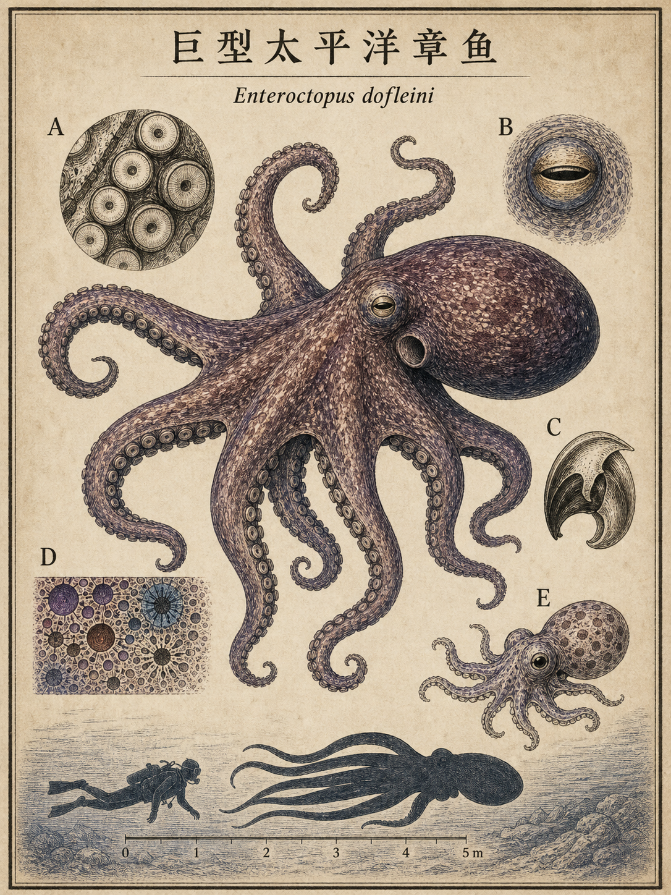

**标签：** `科学插画` `版画` `标本图`　**画幅：** `3:4`

```text
制作一张19世纪自然史图鉴风格的深海生物科学版画，主题为[物种名称]。中央呈现完整侧视主体，周围按编号展示触手、发光器官、口器和幼体四处局部放大；下方加入与潜水器或人类的尺寸比例剪影。使用铜版蚀刻线条结合少量手工上色，背景为泛黄但干净的棉纸，墨色深褐，主体色彩依据真实物种控制在靛蓝、紫灰和微弱荧光青。标题写“[中文名] / [拉丁学名]”，其余标注只用A–E编号，避免伪造科普段落。解剖结构可信、对称性与肢体数量正确。不要奇幻怪兽化，不要恐怖血腥，不要现代3D渲染，不要装饰性海草边框。3:4。
```

---

<a id="case-27"></a>
### 案例 27：黏土微缩早餐店

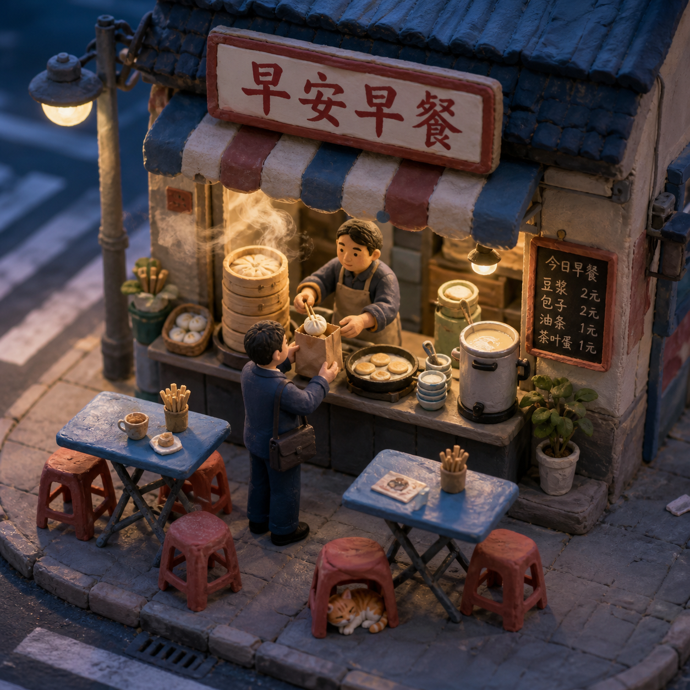

**标签：** `黏土` `微缩` `治愈`　**画幅：** `1:1`

```text
创建一个手工黏土微缩场景：“清晨六点的街角早餐店”。以45度俯视的盒景构图，店面占画面中央，能看到蒸笼、煎锅、豆浆桶、小黑板菜单、两张折叠桌；店主正在夹包子，一位上班族接过纸袋，一只橘猫趴在塑料凳下。所有物体呈手捏黏土质感，保留轻微指纹、圆润边缘和不完全平整的涂色；蒸汽可用半透明棉絮效果。晨光从左侧照入，暖黄店内灯与清冷街道形成对比。招牌仅写“早安早餐”，文字清楚。不要真实人物皮肤，不要过度光滑3D，不要塞满食物，不要玩具包装框。1:1，温暖但不幼稚。
```

---

<a id="case-28"></a>
### 案例 28：纸张拼贴情绪景观


**标签：** `拼贴` `抽象叙事` `纸艺`　**画幅：** `4:5`

```text
将情绪“[情绪，例如重新开始]”转化为一幅纸张拼贴景观。画面底部是撕裂的深灰纸层，中央一条狭窄的暖白道路穿过重叠山体，远处升起一个由半透明描图纸剪成的太阳；道路旁只出现一个很小的人物剪影。使用真实手工纸、旧书页、棉线、蜡笔和少量金箔，所有边缘可见剪刀切口、撕纸纤维与胶水轻微痕迹。色彩从底部炭黑、靛蓝逐渐过渡到顶部杏色、金黄，以材质和方向表达情绪变化。构图安静、有明确视觉出口。不要直接写情绪文字，不要励志标语，不要数字拼贴感，不要随机素材堆积。4:5，艺术书封面级完成度。
```

## 🧍 角色、IP 与一致性

<a id="case-29"></a>
### 案例 29：同一角色九宫格设定

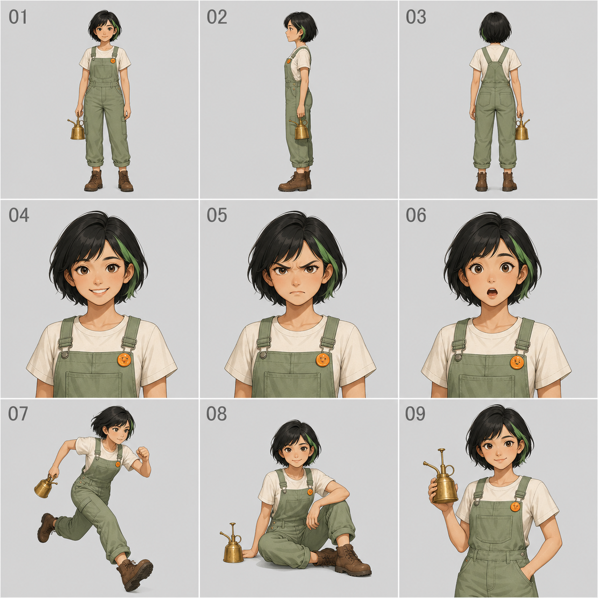

**标签：** `一致性` `角色设定` `九宫格`　**画幅：** `1:1`

```text
基于角色说明生成一张3×3角色一致性设定板。角色：[年龄、性别表达、体型、发型发色、眼睛、肤色、服装、标志物]。九格依次为：正面标准像、左侧面、背面、微笑、愤怒、惊讶、跑步动作、坐姿、手持[标志道具]。每格必须是同一个角色：脸型、发型轮廓、服装颜色、纹样位置、鞋子和道具完全一致，只改变视角、表情或姿态。全身格保持相同比例，头肩格保持相同镜头。背景统一浅灰，细线分格，每格左上角用01–09编号，不添加其他文字。风格为[动画/半写实/像素等]，色板固定为[颜色]。不要随机换装，不要年龄漂移，不要左右配件互换，不要额外角色。1:1高清设定板。
```

---

<a id="case-30"></a>
### 案例 30：品牌吉祥物表情包

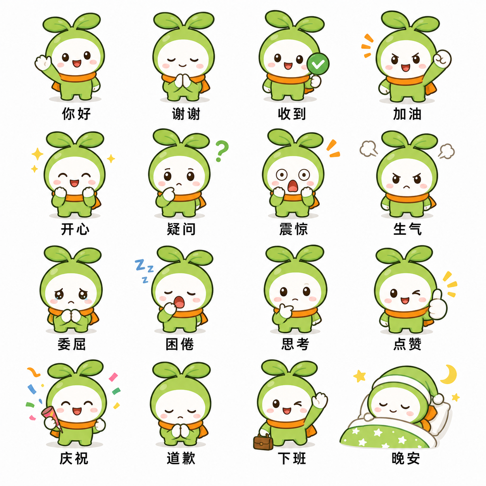

**标签：** `吉祥物` `表情包` `透明背景`　**画幅：** `1:1`

```text
为品牌吉祥物[角色名与外观说明]设计一套4×4表情动作表。16格分别表达：你好、谢谢、收到、加油、开心、疑问、震惊、生气、委屈、困倦、思考、点赞、庆祝、道歉、下班、晚安。严格保持角色头身比、轮廓、主辅色、眼睛形状与胸前标志一致；动作夸张但肢体清楚，每格只出现一个角色。使用粗细统一的外轮廓、平涂色与很轻的阴影，适合缩小到128px阅读。每格下方只放两个至四个字的指定中文短语，字要准确、粗大。白色或透明感背景，格间距相同。不要复杂场景，不要渐变特效，不要改变角色服装，不要多余对白。1:1表情包总表。
```

---

<a id="case-31"></a>
### 案例 31：国风游戏角色三视图

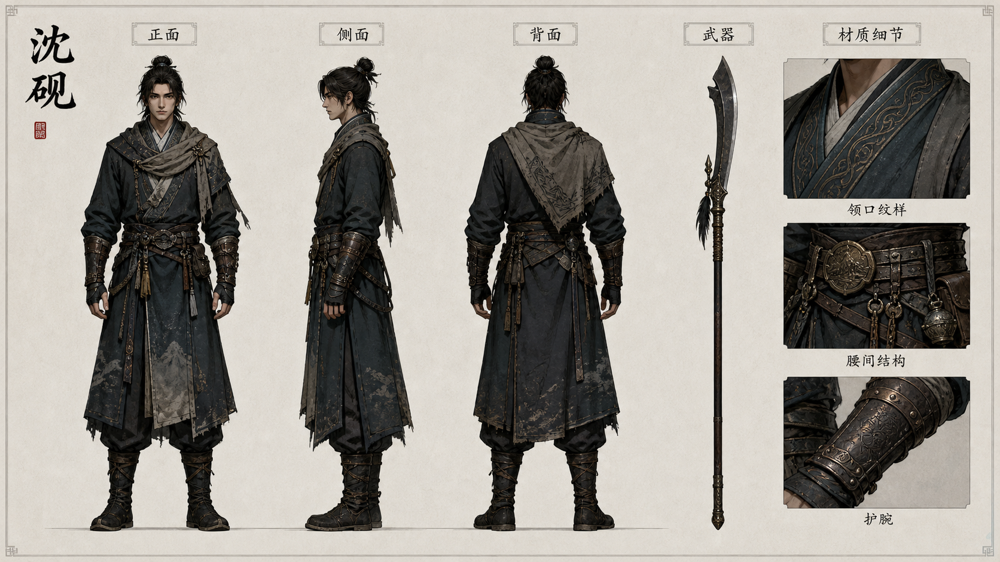

**标签：** `三视图` `游戏角色` `服装结构`　**画幅：** `16:9`

```text
为国风动作游戏设计角色“[角色名/职业]”三视图。角色设定：[年龄气质]，来自[地域/时代灵感]，使用武器[武器]。画面并列展示正面、严格侧面、背面三个自然站姿，全身比例、头部高度、腰线和脚底基准线完全一致；右侧附武器单独展示和三处材质特写：领口纹样、腰间结构、护腕。服装从真实[历史服饰元素]提炼为可活动的分层结构，颜色限制在[主色、辅色、强调色]，金属、皮革、布料可区分。浅米灰设计纸背景，细基准线，无场景。不要影楼古装，不要仙侠光效，不要左右结构矛盾，不要武器尺寸变化，不要过多飘带。16:9，游戏建模可参考的设定稿。
```

---

<a id="case-32"></a>
### 案例 32：收藏级盲盒产品板

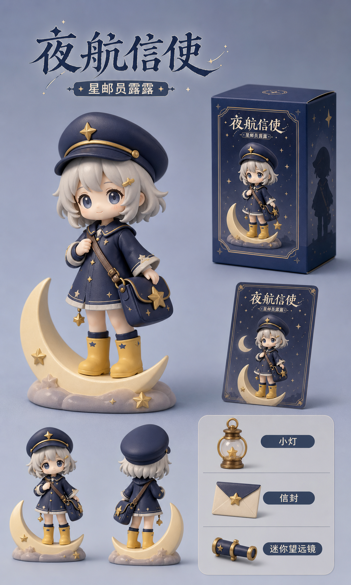

**标签：** `盲盒` `产品设计` `系列化`　**画幅：** `4:5`

```text
把角色[角色说明]设计成收藏级盲盒“[系列名]”主款。中央展示12cm高的完整公仔，以3/4角度站在小型底座上；左下角放正面与背面小视图，右侧展示包装盒、角色卡和三个可替换配件。造型语言统一：头身比1:2.5，眼睛[形状]，表情[气质]，服装关键符号[符号]；材质为细腻哑光PVC，透明件只用于[局部]。包装图案与公仔配色一致，正面文字只写“[系列名] / [角色名]”。棚拍背景为柔和单色渐变，地面有轻微软阴影。不要把公仔画成真人，不要多款挤在一起，不要塑料高光过亮，不要虚构品牌Logo。4:5产品提案板。
```

## 🏛️ 建筑、室内与空间

<a id="case-33"></a>
### 案例 33：滨水图书馆建筑表现

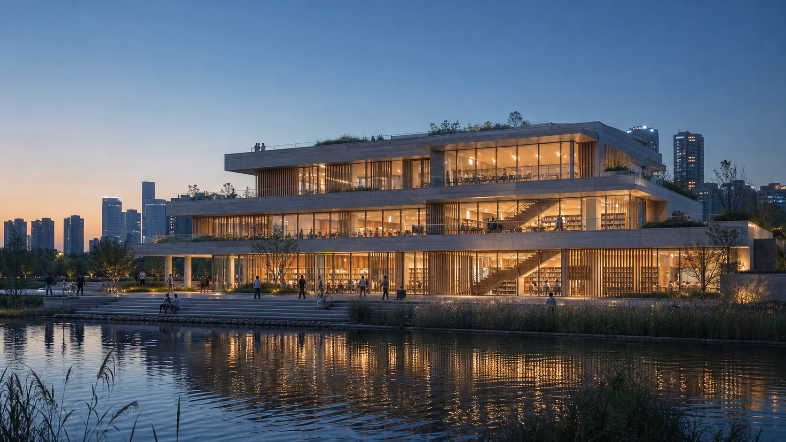

**标签：** `建筑` `环境融合` `黄昏`　**画幅：** `16:9`

```text
生成一张滨水公共图书馆建筑竞赛表现图。建筑由三层水平退台体量组成，首层向河岸开放，屋顶形成可步行花园；主材为浅色清水混凝土、竖向木格栅和低反射玻璃。镜头位于对岸步行高度，35mm广角但垂直线不倾斜，建筑占画面中部55%，前景是缓慢水面与芦苇，远景保留城市天际线。时间为日落后20分钟，室内暖光显示阅览、楼梯与人的尺度，天空冷蓝，水面反射克制。人物数量少而真实，包括阅读者、骑行者和亲子。不要夸张悬挑，不要镜面玻璃盒，不要鸟瞰，不要梦幻灯光秀。16:9，建筑摄影可信度与竞赛叙事感兼具。
```

---

<a id="case-34"></a>
### 案例 34：小户型日式原木客厅

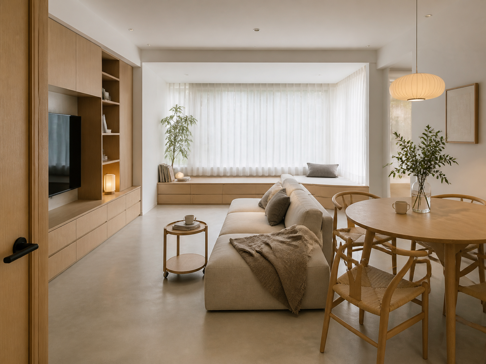

**标签：** `室内` `小户型` `真实尺度`　**画幅：** `4:3`

```text
设计一个实际面积约28平方米的客餐厅，风格为克制的日式原木现代主义。镜头从入口看向窗户，24mm室内镜头，保持空间尺度真实。左侧是一字型浅橡木电视收纳墙，中央低矮米灰沙发与可移动边几，右侧靠墙放四人圆餐桌，窗边设置带抽屉的阅读榻。使用白色微水泥墙、浅橡木、亚麻、藤编和少量黑色金属，所有家具尺寸适合小户型并保留通行路径。下午自然光穿过纱帘，局部暖灯开启。加入少量真实生活痕迹：书、杯子、折叠毯和一盆植物。不要豪宅尺度，不要堆满装饰，不要侘寂破败墙，不要不可实现的悬浮家具。4:3，真实室内摄影。
```

---

<a id="case-35"></a>
### 案例 35：科技展厅轴测拆解图

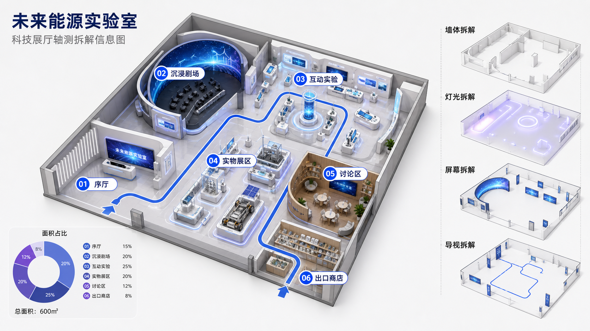

**标签：** `轴测图` `展陈` `空间信息图`　**画幅：** `16:9`

```text
制作“[展览主题]科技展厅”的轴测拆解信息图。把600平方米矩形空间以无透视轴测方式呈现，屋顶和两面墙移除；依参观顺序标出入口序厅、沉浸剧场、互动实验区、实物展区、讨论区、出口商店六个分区。用一条连续蓝色路径和01–06编号显示动线，关键设备包括环幕、触摸桌、投影沙盘、展柜和可移动座椅。右侧排列墙体、灯光、屏幕、导视四层拆解图，左下角放面积占比圆环。白色模型基底，蓝紫光只用于交互区，木色用于休息区，线条细洁。不要科幻飞船内饰，不要人物过多，不要错误楼层，不要密集文字。16:9，建筑分析图与商业提案结合。
```

---

<a id="case-36"></a>
### 案例 36：口袋公园景观方案

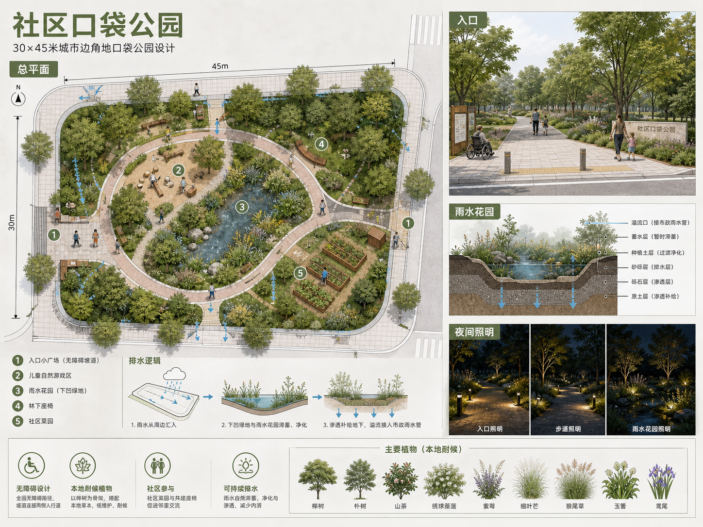

**标签：** `景观` `总平面` `社区`　**画幅：** `4:3`

```text
为一块约30×45米的城市边角地设计社区口袋公园方案板。左侧2/3为彩色总平面：入口小广场、环形步道、儿童自然游戏区、雨水花园、林下座椅、社区菜园，路径无障碍并与两侧人行道连接；树木使用本地耐候种[树种]，雨水从铺装流向下凹绿地。右侧1/3纵向展示入口透视、雨水花园剖面和夜间照明小图。用编号与图例对应，不写长段落。风格为专业景观竞赛板，浅灰底、植物绿、土壤棕、雨水蓝，线稿与柔和拼贴结合。不要主题乐园，不要大面积草坪，不要无意义曲线，不要不可维护的水景。4:3横版。
```

## 📚 教育、文档与出版

<a id="case-37"></a>
### 案例 37：儿童太阳系折页

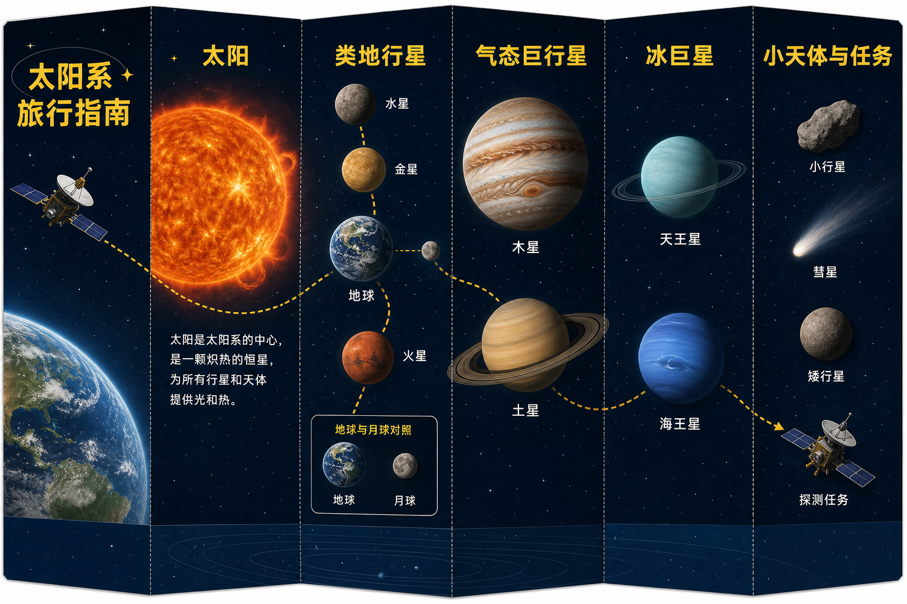

**标签：** `儿童科普` `折页` `准确文字`　**画幅：** `3:2`

```text
设计一张面向8至10岁儿童的“太阳系旅行指南”三折页展开图。横向分为六栏：封面、太阳、类地行星、气态巨行星、冰巨星、小天体与任务。行星按距太阳顺序出现，大小可适度夸张但相对差异可辨；每个行星只保留名称、一个准确数字[由用户提供]和一句不超过15字的记忆点。用一艘小探测器沿连续轨迹引导阅读，加入地球与月球的小比例对照。深靛蓝背景，行星插画有真实纹理但边缘友好，标题黄色，正文白色，折线安全区清楚。不要把行星顺序画错，不要给土星以外所有行星加环，不要编造事实，不要幼儿卡通化。3:2展开页，可印刷折叠。
```

---

<a id="case-38"></a>
### 案例 38：高中数学知识结构页

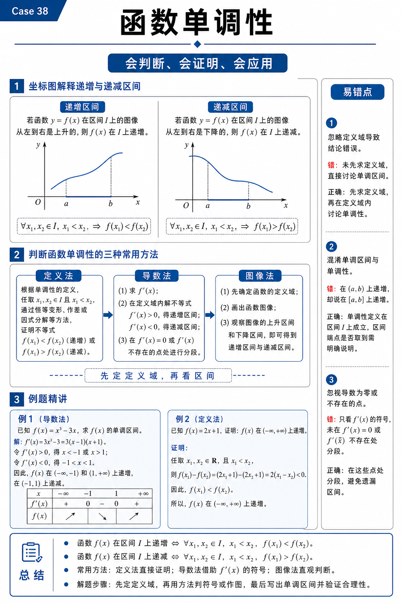

**标签：** `教材` `知识结构` `公式排版`　**画幅：** `A4竖版`

```text
生成一页高中数学复习讲义《函数单调性》，A4竖版。顶部为标题和一句目标“会判断、会证明、会应用”；正文分三层：第一层用坐标图解释递增与递减区间，第二层用流程箭头展示“定义法—导数法—图像法”的选择逻辑，第三层放两个例题卡：例1判断区间，例2由参数讨论单调性。公式只使用用户提供的[公式与题目]，数学符号清楚、上下标准确。右侧窄栏列出三条易错点，底部用一条总结框写“先定定义域，再看区间”。黑白灰为主，蓝色标重点，红色只标错误，像专业教辅而非花哨信息图。不要伪造公式，不要插入无关插画，不要拥挤。A4，300dpi印刷感。
```

---

<a id="case-39"></a>
### 案例 39：悬疑小说封面

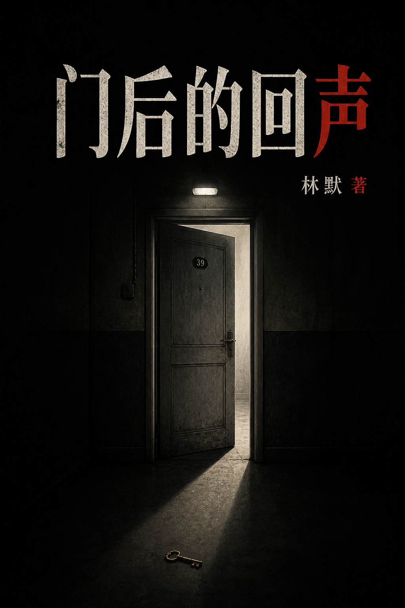

**标签：** `书封` `悬疑` `视觉隐喻`　**画幅：** `2:3`

```text
为悬疑小说《[书名]》设计正封面。故事线索：[一句话线索]。主视觉是一扇半开的旧公寓门，门缝内没有人物，只看到一条反常地向外延伸的室内影子；地面放一个与剧情有关的微小物件[物件]。镜头正对门，几何构图极简，顶部和两侧大面积暗色负空间。色彩只用煤黑、脏白和一点警示红，材质为哑光纸与细颗粒，光线像走廊感应灯刚亮。书名巨大但被门缝切割一小部分，仍必须完整可读；作者名“[作者名]”置底。不要血迹、凶器、人物脸、警戒线等直白元素，不要虚构腰封推荐。2:3，文学悬疑而非廉价惊悚。
```

---

<a id="case-40"></a>
### 案例 40：博物馆展览手册跨页

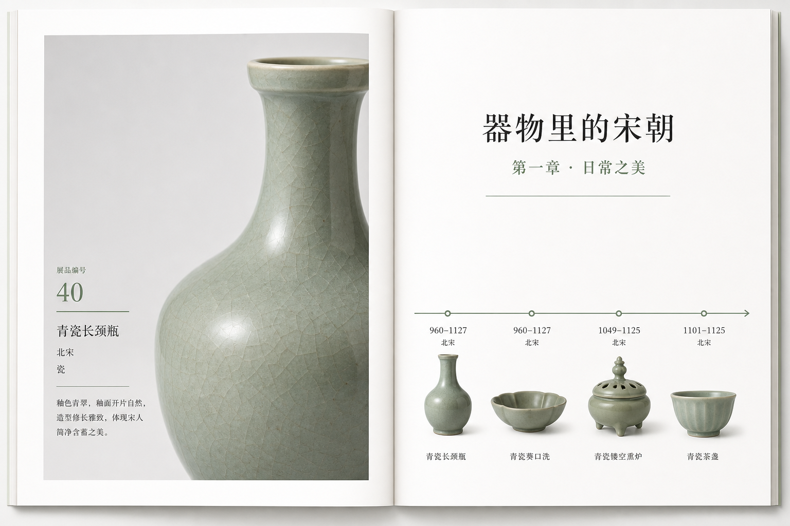

**标签：** `出版设计` `博物馆` `跨页`　**画幅：** `3:2`

```text
设计博物馆展览“[展览名]”手册的一组展开跨页。左页以一件[展品名称]的高质量局部照片占2/3，剩余区域放展品编号、年代、材质和80字以内说明；右页上方为章节标题“[章节名]”，下方用时间轴串联4件相关展品的小图与年份。整套版式使用严格基线网格、宽页边距、衬线标题与无衬线正文，颜色从展品提取一种深色作为页码和细线强调。纸张为自然白，图片色彩准确，跨页中缝不压住关键物体或文字。不要仿古边框，不要满页纹样，不要虚构馆藏Logo，不要生成大段乱码。3:2横向展开，编辑出版品质。
```

## 📱 社交媒体与营销内容

<a id="case-41"></a>
### 案例 41：小红书步骤卡片

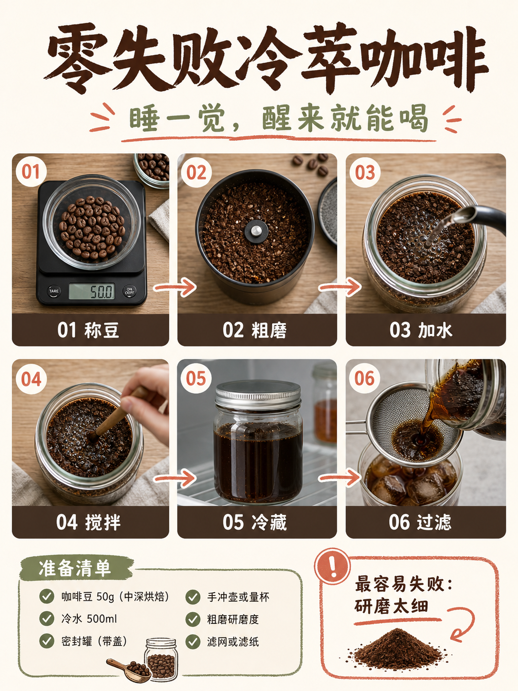

**标签：** `社媒` `教程` `步骤卡`　**画幅：** `3:4`

```text
生成一张小红书风格但不模仿具体账号的教程卡片，主题“[教程主题]”。顶部标题必须写“[标题]”，副标题“[一句收益]”；中部用2×3网格展示6个步骤，每格包含统一视角的真实操作照片、醒目编号和不超过10字的动作说明：[步骤1至步骤6]。底部放“准备清单”三项与“最容易失败的一点：[提醒]”。背景暖白，标题深棕，强调色珊瑚红和鼠尾草绿，卡片圆角轻微，加入少量手绘箭头但保持整洁。人物手部、工具和前后步骤必须逻辑一致。不要平台Logo，不要点赞收藏图标，不要无意义贴纸，不要把文字压在复杂照片上。3:4手机阅读。
```

---

<a id="case-42"></a>
### 案例 42：公众号头图


**标签：** `公众号` `技术内容` `横幅`　**画幅：** `2.35:1`

```text
为公众号文章《[文章标题]》设计横版头图。文章核心：[一句话摘要]。选择一个清晰视觉隐喻：左侧的[旧方式物体]通过一条转换通道，变成右侧的[新方式物体]，中间用3个简洁节点表示变化过程。标题放左上安全区，只显示“[精简标题，不超过14字]”；右下角留作者标识位置但不生成Logo。整体为高端科技编辑插画，深海军蓝背景，象牙白主体，电光青与暖橙各承担一种信息角色，局部带纸张颗粒和细网格。画面缩小后仍能识别，不要代码瀑布，不要机器人脑袋，不要发光地球，不要复杂UI截图，不要大段文字。2.35:1，兼容公众号裁切。
```

---

<a id="case-43"></a>
### 案例 43：直播间商品背景

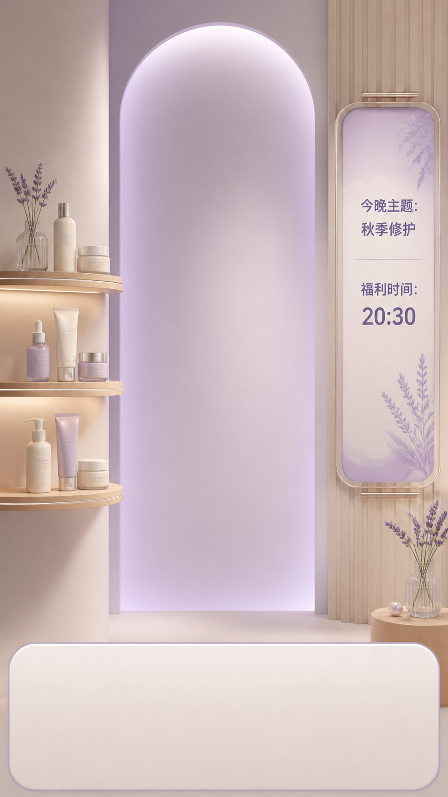

**标签：** `直播` `虚拟布景` `商品展示`　**画幅：** `9:16`

```text
为[商品类别]直播间设计一张9:16虚拟背景。画面中间留出主播半身活动区，不能放文字或高对比物体；左侧设置三层产品陈列架，右侧放一块竖向信息屏，准确显示“今晚主题：[主题]”“福利时间：[时间]”，底部预留商品卡区域。空间风格为[品牌气质]，材质包括哑光墙面、浅木、少量金属，灯光采用正面柔光、两侧轮廓光和背景渐变灯，确保人物抠像自然。品牌色只用于灯带和小面积陈列。不要真实主播，不要平台UI，不要生成价格与折扣，不要镜面反射干扰，不要装饰塞满中央。9:16，1080×1920，考虑安全区。
```

---

<a id="case-44"></a>
### 案例 44：播客节目封面

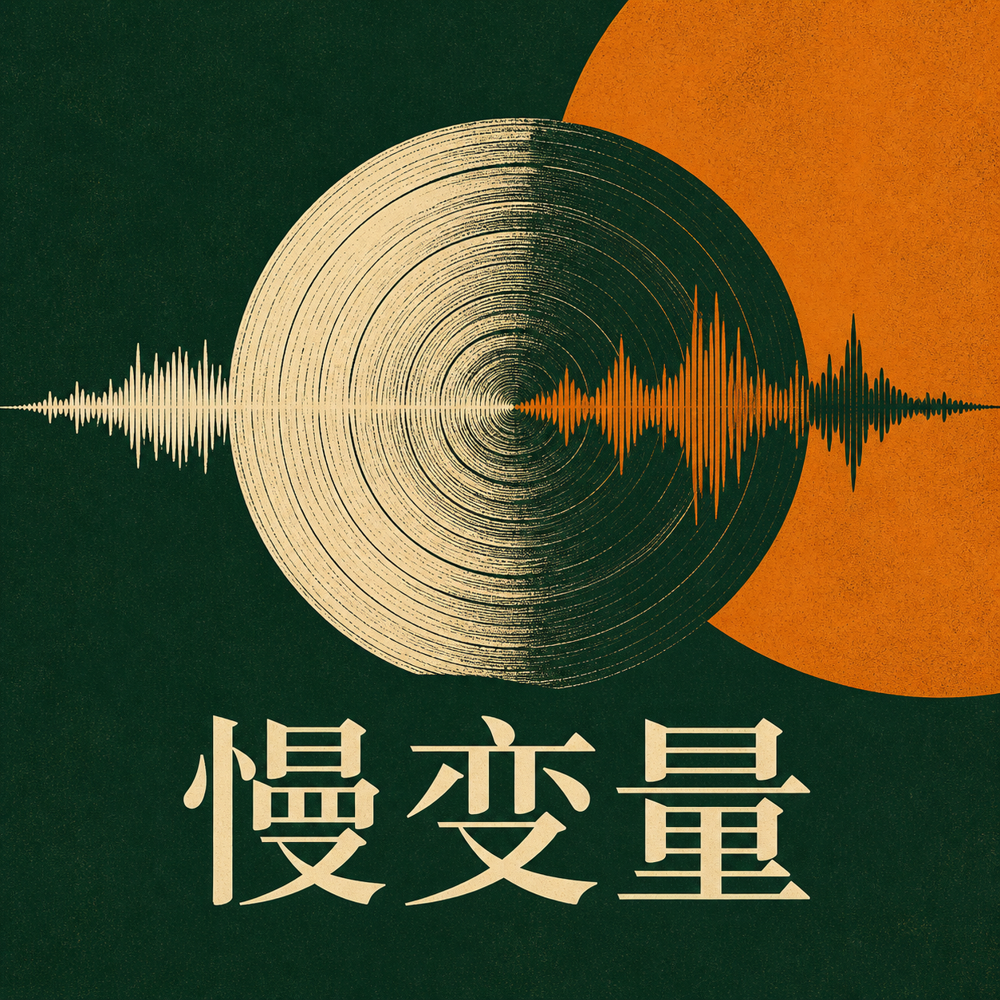

**标签：** `播客` `封面` `小尺寸识别`　**画幅：** `1:1`

```text
为播客“[节目名]”设计方形封面。节目主题：[主题]，气质：[理性/幽默/松弛等]。主视觉只使用一个图形隐喻：一只[物体]同时形成声波与[主题相关形状]，占画面60%；节目名“[节目名]”使用粗体定制字形放在上方或中央，缩小到64px仍可读。配色限制为[主色]、[辅色]、黑与暖白四种，平面图形为主，加入轻微丝网印刷颗粒。不要麦克风、耳机、对话气泡等通用播客符号，除非它们是核心隐喻；不要副标题，不要期数，不要人物拼贴，不要渐变过多。1:1，适合各播客平台圆角裁切。
```

## 🪄 图像编辑与多图合成

<a id="case-45"></a>
### 案例 45：商品图换季节背景

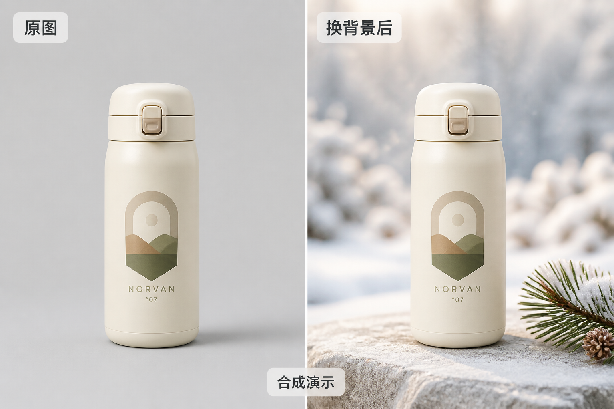

> 例图使用完全虚构的参考素材，仅用于演示图像编辑与合成效果。

**标签：** `参考图` `换背景` `商品保真`　**画幅：** `4:5`

```text
编辑输入商品图：完整保留商品本身的形状、比例、颜色、Logo、标签文字、材质纹理和相机角度，只把原背景替换为[季节，例如初冬清晨]的生活方式场景。商品放在[承托面]上，背景包含[2至3个季节元素]，但所有元素保持虚化且不遮挡商品。根据新环境重建可信的接触阴影、反射、环境色与轮廓光，使商品像真实拍摄而非贴图；商品边缘干净，透明或半透明部位正确折射背景。不要改变包装，不要自动增加文案，不要雪花盖住Logo，不要过度景深，不要增加同款商品。输出比例4:5，商业摄影质量。
```

---

<a id="case-46"></a>
### 案例 46：服装局部改色保材质

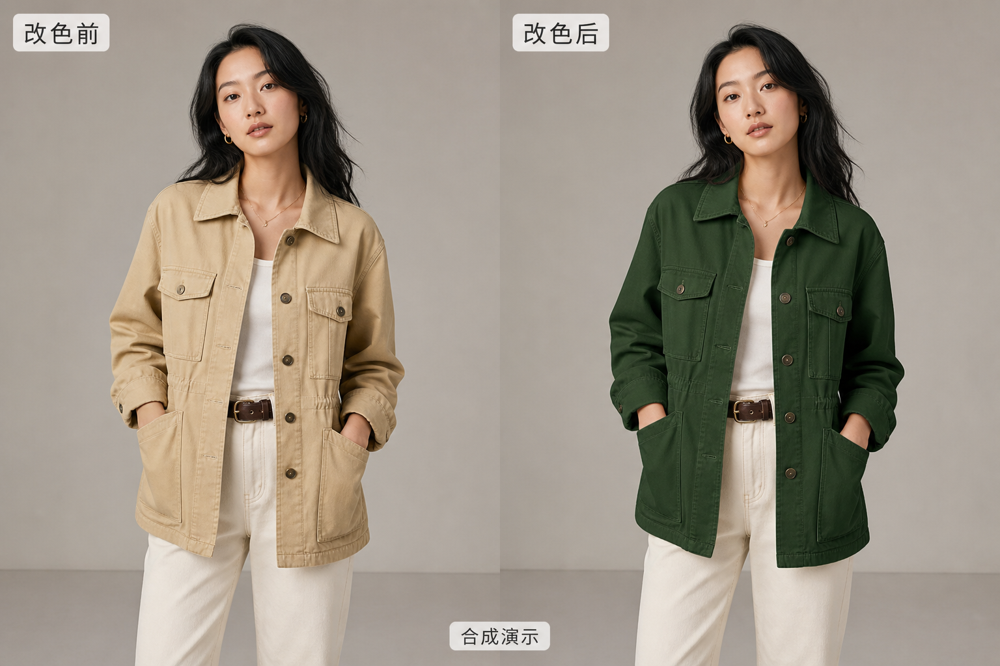

> 例图使用完全虚构的参考素材，仅用于演示图像编辑与合成效果。

**标签：** `局部编辑` `服装` `材质保真`　**画幅：** `原图比例`

```text
编辑输入照片，仅将人物所穿的[服装部位，例如外套]从原颜色改为[目标颜色与色值]。必须保留原服装的版型、缝线、褶皱、拉链、纽扣、口袋、面料纹理、磨损、光照明暗和遮挡关系；颜色变化要随阴影、高光与环境反射自然变化。人物的脸、头发、肤色、身体、其他服装、背景、手持物和构图全部保持逐像素视觉一致。若目标颜色较亮，仍保留原有纹理对比，不要涂成纯色块。不要修改Logo颜色，除非明确指定；不要修身，不要换材质，不要更换背景，不要增加配饰。输出与原图尺寸和比例一致。
```

---

<a id="case-47"></a>
### 案例 47：老照片修复与自然上色

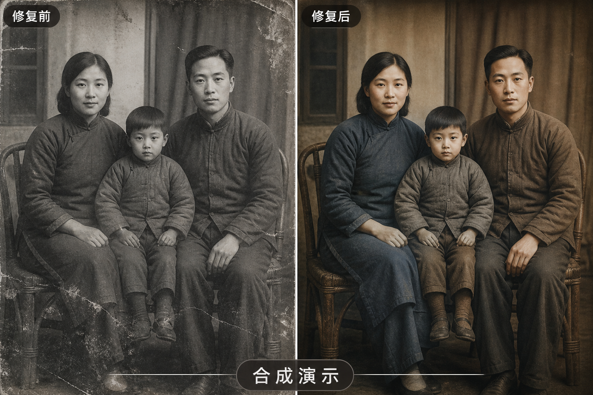

> 例图为完全虚构人物的合成演示，不是真实历史档案。

**标签：** `修复` `上色` `身份保真`　**画幅：** `原图比例`

```text
修复输入的老照片并进行克制、符合年代的自然上色。第一优先级是身份保真：保持每个人的五官、脸型、年龄、表情、姿势、服装结构和相互位置，不重塑成现代审美。去除灰尘、折痕、霉点、轻微划痕和局部褪色，补全缺失区域时只依据周围纹理延续，不新增人物或物品；恢复适度清晰度，但保留真实胶片颗粒与镜头柔度。上色参考[年代、地区、季节]：肤色自然，衣物使用当时常见的低饱和染料色，建筑和家具材质可信。不要过度锐化，不要AI磨皮，不要现代妆容，不要饱和糖果色，不要改变照片裁切。输出原比例，并额外保留一版修复黑白效果的视觉风格。
```

---

<a id="case-48"></a>
### 案例 48：三张参考图统一合成


> 例图使用完全虚构的参考素材，仅用于演示图像编辑与合成效果。

**标签：** `多图合成` `参考图` `光影统一`　**画幅：** `16:9`

```text
将三张参考图合成为一张可信的广告画面：参考图A提供主体人物，严格保留身份、服装与姿态；参考图B提供商品，严格保留包装、Logo与比例；参考图C提供场景和色彩氛围。最终画面中，人物位于左侧三分之一，正自然地拿着商品，商品朝向镜头且标签完整可读；场景延续参考图C的空间结构，但可调整景深以突出主体。统一三者的光源方向、色温、透视、颗粒、清晰度、环境反射和接触阴影，处理好手指与商品的遮挡关系。右侧保留40%干净文案空间，不生成文字。不要把人物脸融合成他人，不要重画商品包装，不要改变场景主题，不要出现多余手指或悬浮商品。16:9，真实商业摄影而非拼贴。
```
